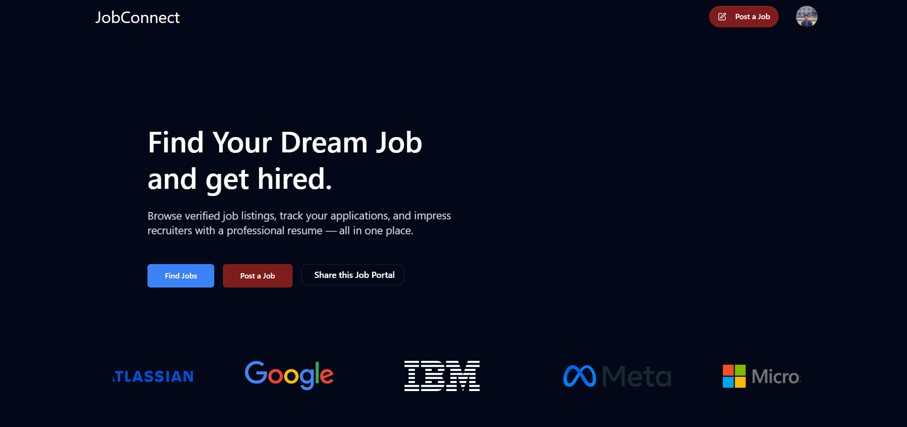
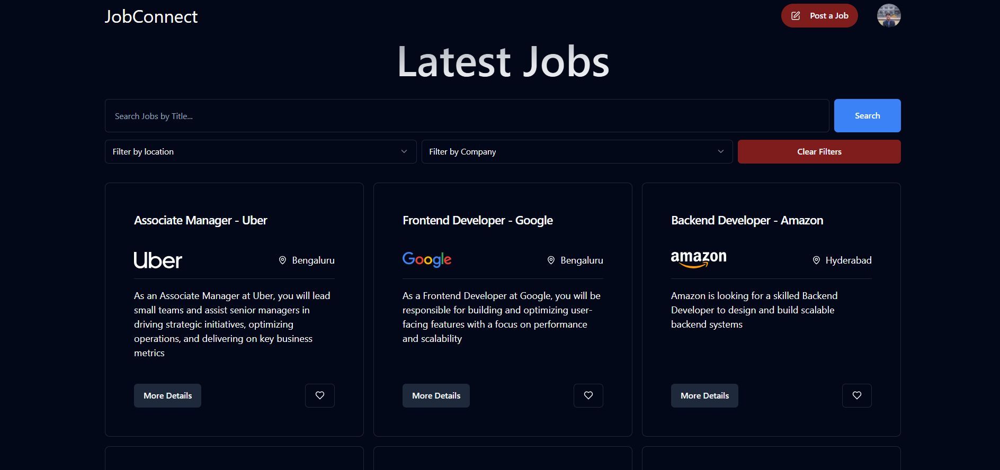
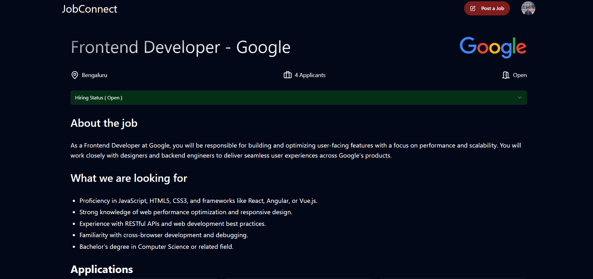
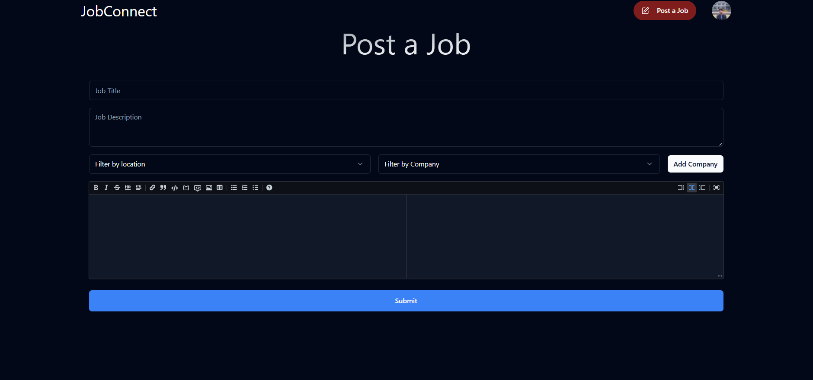

#  JobConnect – Modern Job Portal

JobConnect is a job portal web application built with **React.js**, **JavaScript**, and **Supabase**. It allows users to explore job listings, post jobs (for recruiters), and track job applications (for candidates).

---

## 📌 Preview

**Live Site** → [https://career-connect-sigma.vercel.app](https://career-connect-sigma.vercel.app)  
**Repo** → [https://github.com/kartikey2004-git/JobPortal](https://github.com/kartikey2004-git/JobPortal)

---


## 🛠️ Tech Stack

| Frontend        | Backend/Auth        | Database     |
|-----------------|---------------------|--------------|
| React.js (Vite) | Supabase Auth + API | Supabase DB  |
| Tailwind CSS    | Supabase Functions  | PostgreSQL   |


## ✨ Key Features

- 👨‍💼 **User Roles**: Candidate & Recruiter
- 🔐 **Authentication**: Supabase Auth (email/password)
- 📄 **Job Listings**: Browse all available jobs
- 🎯 **Job Posting**: Recruiters can create and manage listings
- 📬 **Application Tracking**: Candidates can apply and track their applications
- 🔍 **Search & Filters**: Filter jobs by location, role, type, etc.
- 💾 **Database**: Supabase PostgreSQL
- ⚙️ **Responsive UI**: Mobile-first & keyboard-friendly design
---

##  Snapshots

| Home Page | LatestJobs | Jobpage | PostJob
|-----------|-----------|----------------|----------------|
|  |  |  | 

---

## 🧠 Project Overview

The Job Portal follows a frontend-heavy architecture, using Supabase for backend functionality like authentication, data storage, and access control. React manages the UI logic, routing, and application state.

### Supabase Handles:

- User authentication (sign up, login, session management)

- Row-level security for candidates and recruiters

- Job listings storage (PostgreSQL)

- Applications table (candidate-job relation)

- Role-based access control (via custom claims or user metadata)

### Frontend Handles:

- User flows for registration, job posting, and application

- Role-based dashboards (Candidate vs Recruiter)

- Form validation and submission (job forms, profile update, etc.)

- Client-side routing and protected routes (React Router)

- State management using hooks + context (auth, jobs, etc.)

- Responsive design and layout animations (Tailwind + Framer Motion if used)
---

## 🚀 Getting Started Locally

### Clone the repo:
```bash
```bash
git clone https://github.com/your-username/jobconnect.git
cd jobconnect
```

### Install dependencies
```bash
npm install
```

### Add your Supabase keys

```bash
.env

VITE_SUPABASE_URL=your-supabase-url
VITE_SUPABASE_ANON_KEY=your-anon-key
```

### Run locally
```bash
npm run dev
```


🗂️ Folder Structure
```php

url-shortener/
src/
├── components/             # Reusable UI components
├── pages/                  # All main routes (Browse, Apply, Dashboard)
├── data/                   # Static JSON (FAQs, icons, etc.)
├── services/              # Supabase integration & helper functions
├── hooks/                 # Custom React hooks (e.g. auth handling)
├── utils/                 # Utility functions (formatting, validation)
├── App.jsx                 # Main routing & layout
└── main.jsx                # React DOM root 
```


**✨ Features**

- Role-based access for Candidates and Recruiters

- Post new jobs with title, description, requirements, etc.

- Apply to jobs directly from candidate dashboard

- Track application status (applied, interviewing, hired, rejected)

- Update status from recruiter dashboard with dropdown UI

- View job details, company info, and required skills

- Authentication & Authorization via Supabase (email/password)

- Protected routes based on login and user type

- Responsive design for mobile, tablet, and desktop

- Real-time data sync using Supabase subscriptions (optional)

- Friendly UI with loading states, notifications, and clean UX

---

## License: This project is open-source. Feel free to fork, star, or contribute.